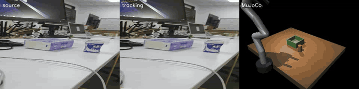
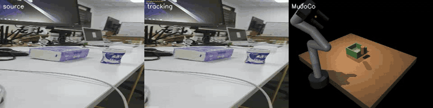

# WebVideo to Data

把人类操作视频转换为可检查、可回放的机器人伪数据。

项目当前处于可行性验证阶段。第一版只处理清晰、短时、单物体刚体操作，并用 primitive 7-DoF Panda-like model 做 MuJoCo 诊断回放。当前模型不是官方 Franka Panda，且尚未实现完整碰撞验证，因此不会产生 auditable physics-action output。

## 项目要回答的问题

给定一段普通手机或网络视频，我们想知道：

1. 能否稳定提取物体运动与手物接触阶段？
2. 单目深度和尺度误差会怎样影响三维轨迹？
3. 这条轨迹能否映射到目标机器人的工作空间？
4. 机器人在仿真中能否完成同一个操作结果？
5. 哪些失败视频应该被拒绝，哪些仍可用于视频表征或检索？

首轮不训练通用策略。先把从视频到仿真回放的证据链跑通，再判断是否值得增加数据量和策略学习。

## 首轮实验

### EXP-001 实测状态

已用锁定 ROI `[374,423,104,155]` 和真实 `video/手机录制.mp4` 完成端到端运行。B0 的 `physics_grasp` reachability 为 0.0235656，无双指接触、lift=0、未放置；B1 仅为 `kinematic_replay` 诊断，也未放置。两者均写 rejection 且不导出 `actions.npz`。B2–B4 因 `metric_depth_not_available` 记录为 `not_run`，没有复制 B1 指标。另有一条独立门禁：primitive 模型尚无完整 collision validation，所有变体均为 `action_export_eligible=false`。

LK 的 `lk_point_availability_ratio=1.0` 仅表示点 confidence/forward-backward availability，不是语义准确率。人工视觉 QA 观察到放置后点从罐体漂到手上；因此 B1 的 endpoint/path 不可靠，罐体中心 checkpoint error 未测量。见 [`semantic-assessment.json`](experiments/EXP-001-phone-can-mujoco/semantic-assessment.json)。

完整实测报告与机器指标见 [`experiments/EXP-001-phone-can-mujoco/report.md`](experiments/EXP-001-phone-can-mujoco/report.md) 和 [`metrics.json`](experiments/EXP-001-phone-can-mujoco/metrics.json)。可再生成的媒体位于 ignored `artifacts/EXP-001/`。

### 直观实验结果

#### B0：physics diagnostic



B0 动画展示了完整链路确实执行，但不是成功抓取：IK reachability 只有 0.0235656，没有持续双指接触，物理 lift 为 0，最终被拒绝。

#### B1：kinematic diagnostic



B1 动画更接近视频中的物体运动，但它使用对象位姿覆盖，不是物理抓取。人工视觉 QA 还观察到放置后 LK 点从罐体漂到手上，因此 endpoint/path 不可靠，最终同样被拒绝。

精选可视化发布在 [`exp001-diagnostic-v0.1`](https://github.com/KKqdtjo/webvideo-to-data-mvp/releases/tag/exp001-diagnostic-v0.1)：

| 变体 | 视频—仿真并排回放 | 跟踪叠加 | MuJoCo 回放 | 检查帧 |
| --- | --- | --- | --- | --- |
| B0 physics diagnostic | [side-by-side](https://github.com/KKqdtjo/webvideo-to-data-mvp/releases/download/exp001-diagnostic-v0.1/B0-side-by-side.mp4) | [tracking overlay](https://github.com/KKqdtjo/webvideo-to-data-mvp/releases/download/exp001-diagnostic-v0.1/B0-tracking-overlay.mp4) | [MuJoCo replay](https://github.com/KKqdtjo/webvideo-to-data-mvp/releases/download/exp001-diagnostic-v0.1/B0-mujoco-replay.mp4) | [contact sheet](https://github.com/KKqdtjo/webvideo-to-data-mvp/releases/download/exp001-diagnostic-v0.1/B0-contact-sheet.png) |
| B1 kinematic diagnostic | [side-by-side](https://github.com/KKqdtjo/webvideo-to-data-mvp/releases/download/exp001-diagnostic-v0.1/B1-side-by-side.mp4) | [tracking overlay](https://github.com/KKqdtjo/webvideo-to-data-mvp/releases/download/exp001-diagnostic-v0.1/B1-tracking-overlay.mp4) | [MuJoCo replay](https://github.com/KKqdtjo/webvideo-to-data-mvp/releases/download/exp001-diagnostic-v0.1/B1-mujoco-replay.mp4) | [contact sheet](https://github.com/KKqdtjo/webvideo-to-data-mvp/releases/download/exp001-diagnostic-v0.1/B1-contact-sheet.png) |

这些视频用于直观检查数据链路，不代表动作有效：B0 没有完成物理抓取，B1 通过对象位姿覆盖产生运动学回放且存在跟踪点漂到手部的问题。两者都被拒绝，均未导出机器人 action。Release 不包含原始手机视频、凭据或 NPZ 数据。

### 输入视频

主样本：[`video/手机录制.mp4`](video/手机录制.mp4)

- 时长：7.019 秒
- 分辨率：540×960
- 帧率：30 FPS
- 编码：HEVC
- 内容：第一视角抓取饮料罐，将其放到纸盒上

该样本有清楚的手、刚体物体和接触阶段，镜头运动有限，适合验证 pick-and-place。另一个短视频是瓶子翻转，包含快速旋转、抛掷和液体动力学，暂不作为首轮目标。两个吉他视频属于长时、双手、灵巧接触任务，也放到后续处理。

### 仿真配置

| 项目 | 选择 |
| --- | --- |
| 仿真器 | MuJoCo |
| 机器人 | primitive 7-DoF Panda-like diagnostic model（非官方 Franka Panda） |
| 末端执行器 | primitive 二指夹爪 |
| 场景 | 桌面、圆柱体饮料罐、长方体纸盒 |
| 控制方式 | 首轮使用末端位姿参考 + IK；后续可加入 operational-space controller |
| 任务成功 | 罐体被抓起，并稳定落在纸盒顶面指定区域 |

MuJoCo 适合当前环境：安装轻、CPU 可运行，也不要求 Omniverse。但当前 primitive XML 禁用了部分 arm/hand collision geometry，尚不能提供完整的 self/table/box/penetration validation。NVIDIA V2D/CHORD 仍是中期基线，但需要兼容的 NVIDIA GPU、Docker、Isaac Lab、MANO 和外部数据集。

## 数据流水线

```text
raw video
  -> normalized clip
  -> object/hand masks and point tracks
  -> contact phases
  -> depth, camera motion and scale estimate
  -> object trajectory in a canonical scene frame
  -> robot end-effector and gripper reference
  -> IK and reachability diagnostics (collision validation pending)
  -> MuJoCo replay
  -> sim-validated episode or explicit rejection
```

### 1. 视频规范化

保留原文件，生成固定帧率和统一色彩格式的实验副本。每次转换记录 ffmpeg 命令、输入输出哈希、裁切范围和时间戳映射。HEVC 只在读取不兼容时转为 H.264；不反复有损转码。

### 2. 操作片段与阶段

首轮视频很短，不需要 VLM 自动切片。仍要标出：

```text
approach -> contact onset -> grasp/hold -> transport -> release -> settle
```

原设计提出将自动估计与人工标注对照；EXP-001 尚未制作 contact ground truth 或像素级物体标注。当前 contact 字段来自自动阶段推断，并如实保留低置信 release/settle warning。

### 3. 二维运动

在饮料罐可见区域初始化跟踪点，得到物体表面的 point tracks；同时估计手部关键点或 hand mask。物体 mask 用于剔除背景点，稳健估计二维中心、尺度和旋转。

首轮优先比较可复现的开源模型：

- 视频物体分割：SAM 2；
- 点跟踪：CoTracker 或 TAPIR；
- 手部证据：MediaPipe Hands 作为轻量基线，必要时再换 HaMeR/HaWoR。

模型选择以实际环境能稳定运行和许可证允许为准，最终版本会锁定权重与配置。

### 4. 三维轨迹

单目视频没有天然公制尺度。三维恢复必须显式记录假设：

- 相机内参来自视频元数据、标定或模型估计；
- 相对深度来自 MoGe 系列或同类模型；
- 公制尺度在后续设计中应由已知罐体尺寸、桌面几何或人工测量给出；EXP-001 未执行这些测量；
- 相机运动需要和物体运动分离；
- 严重遮挡阶段使用动力学平滑，但不伪造高置信度观测。

输出轨迹至少包含位置、姿态、可见性、来源和协方差/置信度。首轮不要求准确恢复手指关节。

### 5. 人到机器人映射

饮料罐操作映射为：

```text
pre-grasp
  -> approach
  -> close gripper
  -> lift
  -> transport
  -> lower
  -> open gripper
  -> retreat
```

机器人不复制人手腕的每个摆动。末端参考主要由罐体轨迹、抓取轴和接触阶段生成。EXP-001 实际执行工作空间/IK 诊断，但碰撞验证未实现，所以 reference 不能作为 action 导出。

### 6. 仿真回放

先运行手工起终点基线，确认场景、抓取参数和控制器能够完成任务。再逐步替换为视频估计：

| 实验 | 输入 | 用途 |
| --- | --- | --- |
| B0 | 固定 canonical 起点/终点 + 合成 reference phases | 诊断仿真、IK 和抓放逻辑 |
| B1 | LK point tracks + canonical 2D-to-scene replay | 诊断二维运动方向和时序；本次语义漂移使 endpoint/path 不可靠 |
| B2 | point tracks + 单目深度/尺度 | 测试三维恢复误差 |
| B3 | B2 + 自动 contact phases | 测试完整视频转换链 |
| B4 | B3 + 轨迹平滑和物理修正 | 衡量约束优化带来的改进 |

## 评测指标

### 感知层

- 物体 mask 的时序稳定性；
- 有效点轨迹比例和中位跟踪长度；
- contact onset/release 相对人工标注的时间误差（EXP-001 未测）；
- 遮挡区间与低置信区间的覆盖率；
- 三维轨迹的重投影误差、平滑度和尺度一致性。

### 机器人映射层

- IK 可解帧比例；
- 末端位置/姿态跟踪误差；
- 关节位置、速度和加速度越界次数；
- 自碰撞、环境碰撞和预抓取穿透次数（EXP-001 未实现）；

### 仿真层

- 抓取成功率；
- 放置成功率；
- 罐体最终位置和姿态误差；
- 接触后物体漂移、掉落和穿透；
- 相对 B0 需要的人工修正量。

所有成功率都要注明试验次数和随机化范围。单次成功只能证明流水线能跑通，不能证明方法稳定。

## 原设计成功标准（尚未完成）

首轮实验满足以下条件才算通过：

1. B0 在固定场景中能够重复完成抓放；
2. 自动轨迹的 IK 可解率不低于 95%；
3. 自动 contact onset/release 与人工标注误差不超过 0.25 秒；
4. B3 或 B4 在至少 20 次轻量扰动回放中达到 70% 放置成功率；
5. 每次失败都能归类为感知、尺度、映射、控制或物理参数问题；
6. 所有结果都能由锁定配置和一条命令重现。

这些是拟议工程验收线，不是已经通过的结果。EXP-001 没有人工 contact ground truth、metric depth、20 次扰动或 collision validation；B0 也未成功。当前应先修仿真、控制器与碰撞模型，再重新评估视频重建。

## 计划中的目录

```text
Webtodata/
├── README.md
├── summary.md
├── docs/
│   ├── method.md
│   └── superpowers/specs/
├── video/                         # 原始素材，只读使用
├── video-generation/              # 可选生成视频接口；密钥不得进入日志和仓库
├── configs/                       # 版本化实验配置
├── src/webvideo_to_data/          # 后续实现
├── tests/                         # 单元、集成与回放测试
├── artifacts/                     # 可再生成的中间产物，默认不入库
└── experiments/
    ├── README.md
    ├── EXP-000-environment-audit.md
    └── EXP-001-phone-can-mujoco/
```

代码、配置和 EXP-001 诊断结果已经创建；上表仍用于说明仓库结构。

## 当前环境结论

远端 `root@8.160.161.137:1007` 可以非交互登录，系统有 24 vCPU、256 GiB 内存和充足磁盘，但它不是标准 NVIDIA CUDA 环境：

- 设备节点是 `/dev/alixpu*`；
- 没有 `nvidia-smi`、Docker、Isaac Sim 或 Isaac Lab；
- 已装 PyTorch 在导入时缺 `libhggcrt1.so`；
- CUDA toolkit 显示 12.8，但这不足以证明 PyTorch GPU 可用。

因此第一轮不在远端安装 NVIDIA V2D。远端后续可承担 CPU 编排、文件存储或 MuJoCo headless 回放；在补齐厂商运行库前，不安排重型视觉推理。

## 视频生成的使用原则

Seedance 只用于构造受控对照，例如固定相机、无遮挡、单物体抓放。现有手机视频足以启动第一轮，不调用付费 API。

`video-generation/seedance_api.txt` 含敏感凭据。实现中只从环境变量读取 API key，禁止把密钥、Authorization header、完整响应或带签名 URL 写入日志。若该文件曾通过聊天、代码仓库或构建日志共享，应先轮换密钥。

## 相关文献

领域工作、开源状态和项目 URL 见 [`summary.md`](summary.md)。详细实验方法见 [`docs/method.md`](docs/method.md)。
